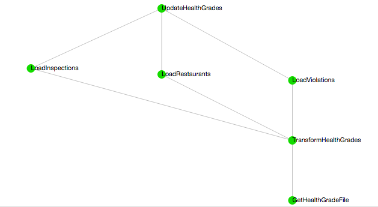
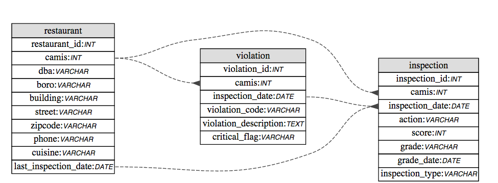

# Totally Thai Time

tl;dr  
http://52.1.178.20:8888  

## DOH ETL pipeline

The ETL process for downloading the DOH's restaurants data, processing the data, and then loading it into a mysql database utilizes [Spotify's Luigi framework](https://github.com/spotify/luigi).

The tasks to accomplish this process include:

1. [GetHealthGradeFile](doh_pipeline/tasks.py#L13) - Task to grab restaurant data from the DOH website.
2. [TransformHealthGrades](doh_pipeline/tasks.py#L40) - Task to clean health grades data and dump it into files to be loaded to db
3.  The follow tasks are all dependent on TransformHealthGrades and can be run simultaneously
  1.  [LoadRestaurants](doh_pipeline/tasks.py#L314)  - Luigi task to load restaurants data from text file into the db
  2.  [LoadInspections](doh_pipeline/tasks.py#L297) - Luigi task to load inspections data from text file into the db
  3.  [Load Violations](doh_pipeline/tasks.py#L283) - Luigi task to load violations data from text file into the db

Prerequisites for running the pipeline  
1. A client.cfg file with the same variables defined in [conf/client.cfg.sample](conf/client.cfg.sample)  
2. Python packages as defined in [requirements_pipeline.txt](requirements_pipeline.txt)    

[DOH Luigi Configurations](conf/client.cfg.sample)  
[doh]  
download_url: *url where doh data is*  
data_dir: *location for luigi task checkpoint files and flat files generated by TransformHealthGrades*  

[db]  
host: *mysql db host*  
user: *mysql db user*  
pass: *mysql db password*  
name: *mysql db name*  

To run the pipeline in test mode  
`python ./doh_pipeline/tasks.py --local-scheduler  UpdateHealthGrades`

To run the pipeline with a scheduler on the localhost  
`python ./doh_pipeline/tasks.py UpdateHealthGrades`

Once the pipeline processes the DOH data, the data is considered loaded and Luigi will make sure the pipeline will not rerun.  Adding the --reload option will delete the data from the db and reload `python ./doh_pipeline/tasks.py UpdateHealthGrades --reload`

## DOH Web App
The DOH web app currently runs as a Python Tornado app on the backend & uses Bootstrap/jQuery for the frontend.

Prequisties for running the web app
1. A server.cfg file with the same variables defined in [conf/server.cfg.sample](conf/server.cfg.sample)  
2. Python packages as defined in [requirements_web.txt](requirements_web.txt)  

To run
`python ./doh_web/server.py`

## DB Schema

Database is normalized since the data set is small and joins are performant.

Random notes:
* Each table has an autoincrementing primary key even when there is a unique key that could act as the primary key.  
* Table foreign key relationships as diagrammed above could have been made slightly more efficient by replacing the compound keys with the autoincrementing primary key. Given the small size of the compound keys and the tables themselves, this seemed like over optimizing for the time being.
* I did not explicitly add foreign key constraints to the tables since, while helpful in keeping data in order, they often cause annoying side effects (table locking, errors when loading large amounts of data, accidental cascading deletes of data etc.) that outweigh their benefits.

### restaurant table
CREATE TABLE `restaurant` (
  `restaurant_id` int(11) unsigned NOT NULL AUTO_INCREMENT,  
  `camis` int(11) NOT NULL,  
  `dba` varchar(255) DEFAULT NULL,  
  `boro` varchar(25) DEFAULT '',  
  `building` varchar(25) DEFAULT NULL,  
  `street` varchar(255) DEFAULT NULL,  
  `zipcode` varchar(5) DEFAULT NULL,  
  `phone` varchar(10) DEFAULT NULL,  
  `cuisine` varchar(100) DEFAULT NULL,  
  `last_inspection_date` date DEFAULT NULL,  
  PRIMARY KEY (`restaurant_id`),  
  UNIQUE KEY `camis` (`camis`),  
  KEY `last_inspection_date` (`last_inspection_date`),  
  KEY `cuisine` (`cuisine`)) ENGINE=InnoDB;  

### inspection table
CREATE TABLE `inspection` (  
  `inspection_id` int(11) unsigned NOT NULL AUTO_INCREMENT,  
  `camis` int(11) DEFAULT NULL,  
  `inspection_date` date DEFAULT NULL,  
  `action` varchar(255) DEFAULT NULL,  
  `score` int(11) DEFAULT NULL,  
  `grade` varchar(15) DEFAULT NULL,  
  `grade_date` date DEFAULT NULL,  
  `inspection_type` varchar(255) DEFAULT NULL,  
  PRIMARY KEY (`inspection_id`),  
  KEY `inspection_date` (`inspection_date`),  
  KEY `camis_inspection_date` (`camis`,`inspection_date`),  
  KEY `grade` (`grade`),  
  KEY `score` (`score`)  
) ENGINE=InnoDB;

### violation table
CREATE TABLE `violation` (  
  `violation_id` int(11) unsigned NOT NULL AUTO_INCREMENT,  
  `camis` int(11) DEFAULT NULL,  
  `inspection_date` date DEFAULT NULL,  
  `violation_code` varchar(11) DEFAULT NULL,  
  `violation_description` text,  
  `critical_flag` varchar(25) DEFAULT NULL,  
  PRIMARY KEY (`violation_id`),  
  KEY `camis` (`camis`,`inspection_date`,`violation_code`),  
  KEY `inspection_date` (`inspection_date`)  
) ENGINE=InnoDB;

## Next Steps

Talk is cheap but some next steps for this project would be...  

* Seperate web app in one repo and pipeline in another repo (or at the very least seperate the deploy process for the two).
* Update pipeline to support incremental updates.  I would imagine doing this by saving the date at the end of the pipeline that the pipleine ran and then on subsequent pipeline runs only importing inspections/violations that occurred after that date.
* Make an upstart script for web app & put it behind an nginx server.
* Either handroll the sql for tornado or (more appealing) move to a multithreaded server so we don't have to worry about singlethreaded locking & sqlalchemy isn't a big pain in the ass (ie flask).
* Add a task at the end of the pipeline to calculate some more interesting restaurant health grade metrics.  Median inspection grade and average inspection score seem particularly interesting.
* Add ability in the website to query restaurants of any cusine (should be pretty straightfoward given the pipeline already ETLs on all of the data).
* Add pagination to web app
* Unit tests (especially for the broken out methods of the TransformHealthGrades task) & Integration Tests (given a subset of the DOH data, verify that the pipepline output is deterministic).
